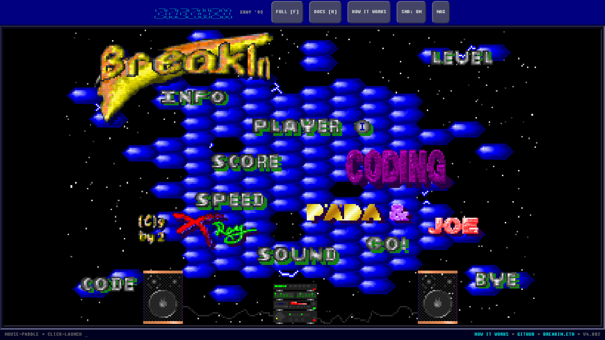

```
 ____  ____  ____  ____  _  _ ____  _  _
(  _ \(  _ \(  __)(  _ \/ )( \(_  _)( \( )
 ) _ ( )   / ) _)  )   /) __ ( _)(_  )  (
(____/(_)\_)(____)(___\_)\_)(_/(____)(_)\_)

          W E B   P L A Y E R
```

```
 ┌──────────────────────────────────────────────────────────────┐
 │  BREAKIN v4.002 - (C) 1993 XRAY PRODUCTIONS                │
 │  Joachim Herrmann & Patrik Schnitzler                       │
 │  Moenchengladbach, Germany                                  │
 │                                                             │
 │  WEB EDITION - 2026 - runs in yr browser, no installs req'd│
 └──────────────────────────────────────────────────────────────┘
```



---

## WTF IZ DIS

**BREAKIN** wuz a 256-color VGA breakout clone released az
shareware in 1993 by **Xray Productions** out of Moenchengladbach,
Germany. SoundBlaster support, 10+ levels, power-ups out the
wazoo, and a registration fee of **$15 USD / 20 DM**. Peak
shareware era.

This project wraps the **original DOS binary** in
[js-dos](https://js-dos.com) so it runs natively in your browser.
No downloads. No DOSBox install. Just load the page and smash
bricks like it's 1993.

```
 ┌─ FEATUREZ ─────────────────────────────────────────────┐
 │                                                        │
 │  [X] Original BREAKIN.EXE running via js-dos/DOSBox    │
 │  [X] Mouse-driven paddle control (native pointer lock) │
 │  [X] SoundBlaster audio emulation                      │
 │  [X] Fullscreen mode [F]                               │
 │  [X] Authentic shareware nag screen on exit             │
 │  [X] Win 3.1 style UI chrome + scanline overlay        │
 │  [X] "How It Works" deep-dive page                     │
 │  [X] Zero dependencies - pure static HTML               │
 │                                                        │
 └────────────────────────────────────────────────────────┘
```

## PLAY IT

Serve the directory with any HTTP server:

```
npx http-server -p 8080
```

Open `http://localhost:8080` in a modern browser. Click the game
area to capture your mouse. That's it. You're in.

## CONTROLZ

```
 MOUSE .............. Move paddle
 CLICK .............. Launch ball / Fire laser
 [F] ................ Fullscreen
 [H] ................ Help / Docs overlay
 ESC ................ Exit fullscreen / Close dialogs
```

## POWER-UPZ

```
 ██ Enlarge ......... Makes yr paddle wider (stacks!)
 ██ Sticky .......... Catches the ball on contact
 ██ Laser ........... Pew pew pew
 ██ Triple .......... Up to 10 balls on screen
 ██ Extra Life ...... +1 life
 ██ Slow Ball ....... Chill mode
 ██ Power Ball ...... Smashes thru everything
 ██ Barrier ......... Shield at the bottom
 ██ Gate ............ Warp to next level
```

## FILE STRUCTURE

```
breakanoid/
├── index.html ............. Main page + game runner
├── how-it-works.html ...... Deep-dive technical breakdown
├── breakanoid.jsdos ....... Bundled DOS filesystem image
├── breakin-files/ ......... Raw game assets (EXE, VOC, PIC, etc.)
├── assets/
│   ├── js-dos.js .......... js-dos emulator runtime
│   ├── js-dos.css ......... js-dos styles
│   ├── emulators/ ......... DOSBox WASM binaries
│   └── fonts/ ............. DOS bitmap font (VT323, PressStart2P)
└── register.html .......... Shareware registration info
```

## GREETZ

```
 ┌──────────────────────────────────────────────────────────────┐
 │                                                              │
 │   G R E E T Z  go out to:                                   │
 │                                                              │
 │   Joachim & Patrik ...... for the original masterpiece       │
 │   js-dos crew ........... for DOSBox in the browser          │
 │   The shareware scene ... $15 got you a level editor lol     │
 │   Everyone who ran                                           │
 │     BREAKIN.EXE from a                                       │
 │     3.5" floppy ......... real ones know                     │
 │                                                              │
 └──────────────────────────────────────────────────────────────┘
```

---

```
 BREAKIN.ETH ........... https://etherscan.io/name-lookup-search?id=breakin.eth
 LIVE DEMO ............. https://breakin.eth (via ENS)
 SOURCE ................ https://github.com/significance/breakin
```

```
  ──────────────────────────────────────────────────
  NO WARRANTY EXPRESSED OR IMPLIED. USE AT YOUR OWN
  RISK. NOT RESPONSIBLE FOR LOST PRODUCTIVITY, SMASHED
  KEYBOARDS, OR SUDDEN URGE TO INSTALL MS-DOS 6.22.
  ──────────────────────────────────────────────────
```
